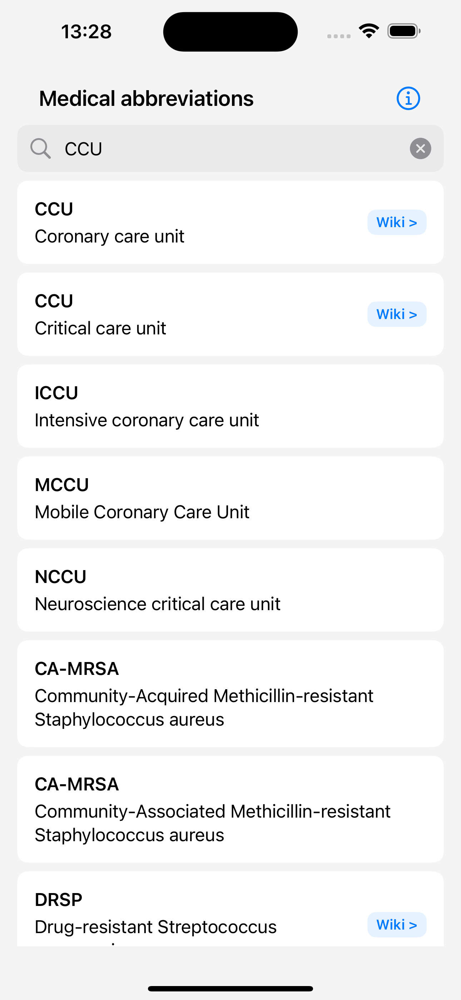

# Medical abbreviations

Simple medical abbreviation dictionary.

## App Store Link
https://apps.apple.com/us/app/medical-abbreviations/id1005507112

## Screenshots

  
  

## Features
- Search medical abbreviations: abbreviation or definition.
- Check Wikipedia definitions when available.
- Both medical abbreviations and Wikipedia definitions are saved in the device for instant offline access.

## Database update

New abbreviations are added on a regular basis, and will be downloaded automatically.

## Privacy Policy

[Privacy Policy](privacy-policy.md)

## Support

If you need assistance, have questions, or would like to provide feedback to the author, please use one of the following methods:

- Email the author: gimbapapps@gmail.com
- Fill in the Google Forms: https://forms.gle/ErXimyrCtsRdiTkU7
- Open an issue on GitHub (if you have an account)
- Leave a review on the App Store